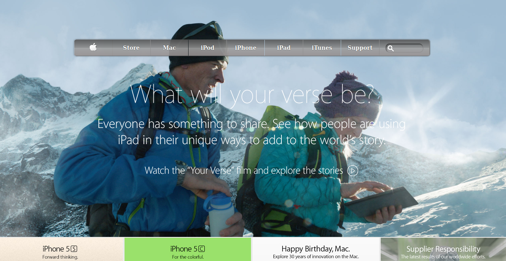

# Apple.com_clone_page

> A clone of [Apple.com page](https://web.archive.org/web/20140301004610/http://www.apple.com/)

Project: Positioning and Floating Elements.

## Built With

- HTML5,
- CSS3,
- Flex

## Live Demo

[Live Demo Link](https://raw.githack.com/mariancristu/Apple.com_clone_page/test/index.html)

## Getting Started

**Use browser of choise**

## Authors

👤 **Cristu Marian**

- Github: [@mariancristu](https://github.com/mariancristu)
- Twitter: [@marian_cristu](https://twitter.com/marian_cristu)
- Linkedin: [marian-cristu](https://www.linkedin.com/in/marian-cristu-b687b3197)

## Show your support

Give a ⭐️ if you like this project!
